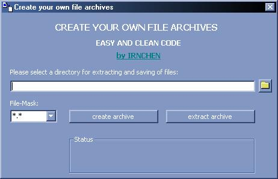

## Making Archives From Directorys

### Description

This code will make an archive from any directory and will show the progress in a progressbar.

Very useful!!!
 
### More Info
 

             |
---                |---
**Submitted On**   |2002-08-16 16:27:06
**By**             |[actorics\.de](https://github.com/Planet-Source-Code/PSCIndex/blob/master/ByAuthor/actorics-de.md)
**Level**          |Intermediate
**User Rating**    |4.9 (34 globes from 7 users)
**Compatibility**  |VB 6\.0
**Category**       |[Files/ File Controls/ Input/ Output](https://github.com/Planet-Source-Code/PSCIndex/blob/master/ByCategory/files-file-controls-input-output__1-3.md)
**World**          |[Visual Basic](https://github.com/Planet-Source-Code/PSCIndex/blob/master/ByWorld/visual-basic.md)
**Archive File**   |[Making\_Arc1210488222002\.zip](https://github.com/Planet-Source-Code/actorics-de-making-archives-from-directorys__1-38176/archive/master.zip)

### Source Code

Hallo!
This is my first tutorial on PSC.
I hope you like this code.

This code gets all files in a folder (you can also use a filter) and stores these files in an archive. While it is doing this it is showing you the progress in an picturebox.

For example it can be used to store files and extract them at runtime, so the user can't copy them.

Good and easy code!

You only have to put the two functions and the sub into your project. Then you only call one of the two functions!!!

